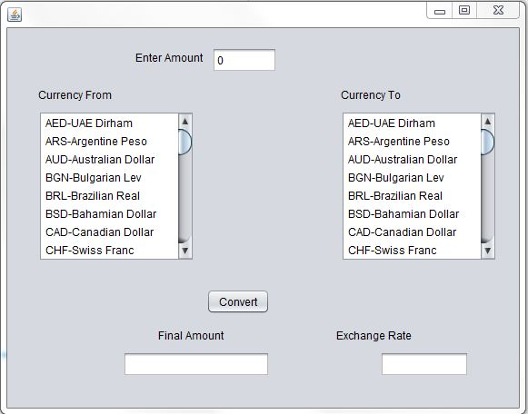
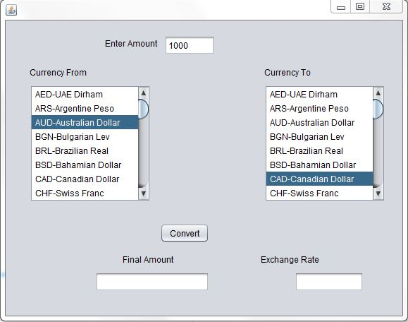
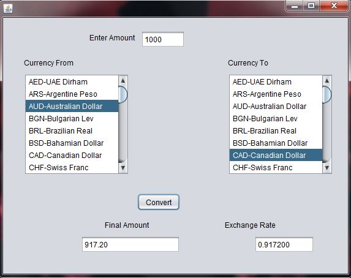
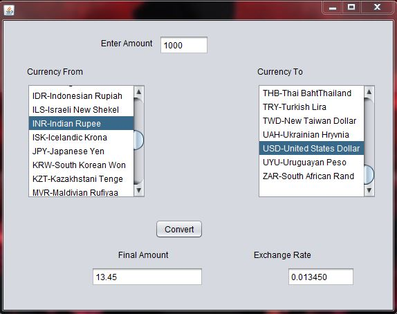
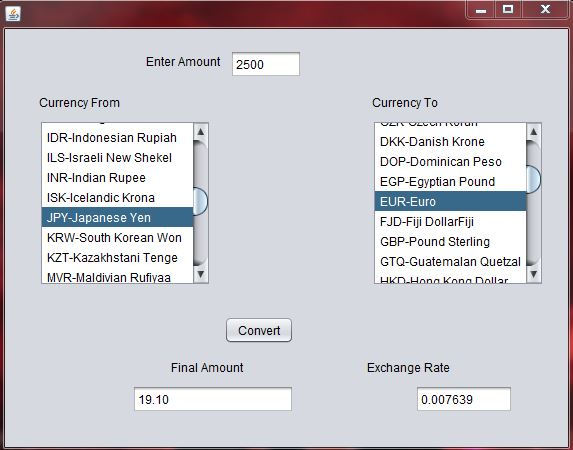

# currency-converter
This application converts one currency into another by using the live exchange rates, provided by ExchageRate Api.It is implemented in netbeans ide and requires gson and
java-json jar to be included in the classpath before use.It is a pc application written in java language.You can download the jar files online.

#Images

